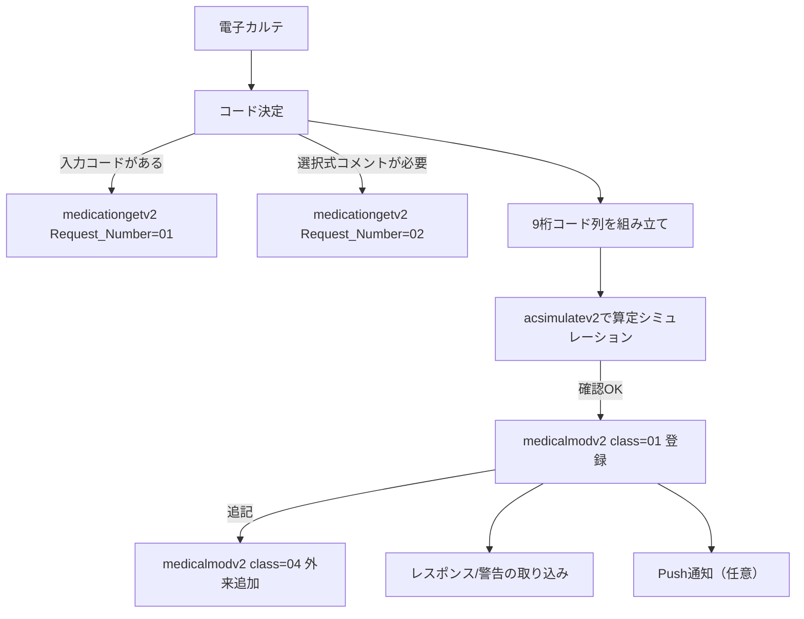

# ORCA連携電子カルテのオーダー仕様 実装要件レポート

実装優先度ランク（高/中/低）
- 高：`medicalmodv2`で中途終了データを正しく作成できること（必須項目、9桁コード、診療種別区分、順序、エラー処理）citeturn8view0turn9view0turn31view1turn27view1  
- 中：マスタ参照と算定検証（`medicationgetv2`で入力コード変換・選択式コメント、`system01lstv2`で診療科/医師コード、`acsimulatev2`で算定シミュレーション、`acceptmodv2`で受付・診察料照会）citeturn11view0turn13view0turn12view1turn17view0  
- 低：Push通知の活用、運用マスタ（ユーザ点数マスタ/コメント等）の整備と自動算定制御の細かな最適化citeturn8view0turn31view1turn6search1turn36view0  

## エグゼクティブサマリ

電子カルテ連携におけるオーダー登録の中核は、日医標準レセプトソフトAPIの`/api21/medicalmodv2`（中途終了データ作成）です。これはCLAIM受信機能に近い位置づけのAPIで、リクエスト/レスポンスはxml2形式、`Content-Type: application/xml`、文字コードはUTF-8が前提です。citeturn8view0turn35view0  

連携上の最重要要件は、オーダーを「9桁の診療行為コード等（点数マスタのコード）」で構成すること、そして「診療種別区分（Medical_Class）」を正しく付けることです。点数マスタの診療行為コードは9桁であることが明記されており、現場運用では4〜5桁の入力コードを割り付けることが推奨されていますが、`medicalmodv2`側では入力コードを使用できない（不可）とされています。citeturn23view0turn31view1  

コード解決と選択式コメント取得は、`/api01rv2/medicationgetv2`が公式に提供されています。リクエスト番号01で入力コード→9桁コード（点数マスタ内容）を取得し、リクエスト番号02で診療行為コードに紐づく選択式コメント一覧を取得します。さらにパッチ提供により、リクエスト番号03として「9桁診療行為コードをキーに点数マスタ名称等を返す」機能追加が告知されています（ただしAPI仕様ページ側の明文化は環境差があり得るため、実装時は接続先バージョンでの動作確認が必要です）。citeturn11view0turn11view1turn25view0  

診療種別区分（画面上は`.210`等、API上は`210`等）や、診療区分ごとの入力構造（薬剤・材料・加算・コメントの並び）は、ORCA外来版マニュアルの「診療区分別の入力方法」が一次資料です。特にコメントは、剤の途中に入れるとレセプト電算でエラーになり得ること、投薬の予約コード（一般名記載/銘柄名記載など）は薬剤直下にある前提で処理されるため、間にコメントを挟むとエラーになり得ることが明記されています。citeturn4search8turn29view1turn36view0  

CLAIM通信は2026年3月末で廃止予定（以降停止はしないが保守・機能追加は行わない）と公式告知されています。既存のCLAIM連携実装がある場合でも、API/Push APIへ切り替える前提で、オーダー仕様をAPI側で完結させる設計が必須です。citeturn19view0  

## 対象範囲と前提

本レポートは、電子カルテからORCAへ「処方・注射・処置・検査・指導/管理料・材料・検体採取等」をオーダーとして登録し、算定・請求に耐えるデータ構造を作るための仕様要件を対象とします。中核APIは`medicalmodv2`、周辺として`medicationgetv2`、`acsimulatev2`、`system01lstv2`、`acceptmodv2`を含めます。citeturn33view0turn8view0turn11view0turn12view0turn13view0turn17view0  

前提・未指定事項は次のとおりです。

|項目|前提/状態|
|---|---|
|対象（外来/入院）|未指定（本レポートの例示は外来中心。入院では`class=04`外来追加が使えない点など差分に注意）citeturn35view0|
|利用形態（オンプレ/クラウド）|未指定（API自体は提供されるが、運用・更新手順は形態で異なる）citeturn24view0turn26view0|
|認証方式|Basic認証がサンプル実装で示される（ユーザー/パスワードは未指定）citeturn11view2turn35view1|
|コード体系・マスタ更新頻度|未指定（ただし点数マスタ更新が提供されること、基準日検索があることは一次資料で確認できる）citeturn18view0turn11view0|
|病名連携の範囲|未指定（`medicalmodv2 class=01`で病名送信は可能だが、外来追加/変更/削除では無効。病名自動算定に関わるため実運用では重要）citeturn35view0turn21view0|

特に、病名起因で自動算定される管理料（例：特定疾患療養管理料など）があるため、オーダー連携だけでなく病名連携も一体で設計するかどうかは、未指定ながら実装全体の成否に影響します。citeturn21view0  

## オーダー項目別の要件表

下表は、実装担当者が「最低限満たすべき要件」をオーダー項目別に整理したものです。共通要件として、`medicalmodv2`の必須項目（患者番号、診療科、ドクター）と、9桁コード中心の構成、診療種別区分の空白禁止（特に1件目）を最上段に置きます。citeturn9view0turn31view1turn27view1  

|オーダー項目|Medical_Class（診療種別区分）例|必須|条件付き必須|任意|データ型/フォーマット|関連API（endpoint/主要パラメータ）|使用すべきマスタ|マスタ検索（パラメータ/返却フィールド）|選択式コメント取得|自動算定・注意点|
|---|---|---|---|---|---|---|---|---|---|---|
|共通（全オーダー）|例：`210`（内服）/`310`（注射）/`400`（処置）/`600`（検査）/`130`（医学管理等）など（画面上は`.210`等）citeturn31view1turn36view0turn6search8turn6search5turn4search12turn21view0|`Patient_ID`（必須）<br>`Department_Code`（必須）<br>`Physician_Code`（必須）citeturn9view0|変更/削除では`Medical_Uid`必須citeturn9view0turn35view0|`Perform_Date`/`Perform_Time`<br>保険情報（組合せ番号/保険情報）<br>`Medical_Push`（Push通知指示）citeturn9view0turn10view1|日付：`YYYY-MM-DD`<br>時間：`HH:MM:SS`<br>コード：原則9桁（点数マスタ）<br>文字コード：UTF-8citeturn8view0turn11view0turn23view0|`/api21/medicalmodv2?class=01/02/03/04`（xml2）citeturn35view0|点数マスタ（診療行為/薬剤/器材/コメント等を含む）citeturn23view0turn16search3|入力コード→9桁：`medicationgetv2`（Request_Number=01）<br>名称検索（API）：未指定（UI機能あり）citeturn11view0turn23view0|`medicationgetv2`（Request_Number=02）でコメント一覧取得citeturn11view0turn11view1|`Medical_Class`が空のまま送ると、診療行為コードがあっても中途データが作成されない事象があり、パッチで「結果コード20/中途データが登録できませんでした」を返す修正が入っています（空白送信を禁止する実装が安全）。citeturn27view1|
|処方（投薬）|内服：`.210/.211/.212/.213`など<br>頓服：`.220...`<br>外用：`.230...`（API上は`210/211/...`）citeturn36view0|`Medical_Class`<br>`Medical_Class_Number`（回数/日数）citeturn31view1turn36view0|頓服/臨時などは診療種別区分が必須（省略不可のケースあり）citeturn36view0|薬剤コード（複数可）<br>用法コード（必要時）<br>一般名指示フラグ/予約コード<br>コメントコードciteturn31view1turn36view0turn23view0|薬剤コード：9桁<br>用法コード例：9桁（例：`001000117`）<br>数量/回数：省略時は1扱い（ただし剤終了判定で省略できない場合あり）citeturn31view1turn6search7turn23view0|登録：`medicalmodv2`<br>入力コード→9桁：`medicationgetv2`（01）<br>9桁→点数マスタ内容：`medicationgetv2`（03：パッチ告知）citeturn35view0turn11view0turn25view0|点数マスタ（医薬品）<br>用法マスタ（ユーザ登録の「用法」）<br>コメント（選択式/フリー）citeturn23view0turn36view0turn23view0|用法/部位/その他/コメント等は、診療行為コード検索の「ユーザ登録」から検索でき、一覧には厚労省提供マスタと自院ユーザ点数マスタが表示されるとされています（APIでの名称検索は未指定）。citeturn23view0|院外処方等で必要な選択式コメントは`medicationgetv2`（02）で取得し、該当コメントコードを送信データに含めるciteturn11view1turn31view1|投薬では調剤料・処方料・処方箋料などが自動算定され、手入力は原則避けるよう注意が明記されています。citeturn36view0<br>また、薬剤直下にある前提の予約コード（一般名記載/銘柄名記載等）の間にコメントが挟まるとエラーになり得るため、コメント展開位置に注意が必要です。citeturn29view1turn35view0|
|注射|`.310/.311/.312`（皮下筋肉）<br>`.320/.321`（静脈）<br>`.330/.331/.332/.334`（点滴）など（API上は`310/320/330...`）citeturn6search8turn12view1|`Medical_Class`<br>`Medical_Class_Number`（回数等）citeturn31view1turn6search8|点滴等で自動振替/自動算定が関与するため、運用・設定に応じて必要項目が変わる（未指定）citeturn6search8turn5search2|注射薬剤コード（9桁）<br>コメントコード（必要時）citeturn12view1turn4search8|薬剤コード：9桁<br>数量：文字列（桁・小数は仕様明記が弱いため要実機確認）citeturn31view1turn6search8|登録：`medicalmodv2`<br>算定検証：`acsimulatev2`（class=01）citeturn12view0turn35view0|点数マスタ（注射薬剤/関連手技）citeturn6search8turn23view0|診療行為検索では「注射（F4）」で薬剤検索ができることが示されています（API検索は未指定）。citeturn23view0|必要時：`medicationgetv2`（02）で選択式コメント取得citeturn11view0turn11view1|薬剤液量により手技料を自動変換する設定があり、`.310`と`.312`で挙動が異なるなど、設定依存の自動算定が明記されています。citeturn5search0turn5search2|
|処置|`.400/.401/.402/.403/.409`（API上は`400/401/...`）citeturn6search5|`Medical_Class`<br>（処置の剤は、手技→加算→薬剤→材料→回数/数量の順を意識）citeturn6search5turn6search7|労災/自賠責等のみで使う区分（`.409`）があるciteturn6search5|薬剤コード/材料コード<br>コメントコードciteturn6search5turn4search8|数量/回数が1の場合は省略可だが、剤終了判別のため省略できない場合ありciteturn6search5turn6search7|登録：`medicalmodv2`<br>算定検証：`acsimulatev2`citeturn35view0turn12view1|点数マスタ（処置行為/処置薬剤/処置材料/処置加算）citeturn6search5turn23view0|UI上の診療行為検索で「器材（F5）」や「診療行為（F6）」検索がある（API：未指定）。citeturn23view0|必要時：`medicationgetv2`（02）で選択式コメント取得citeturn11view0turn11view1|酸素補正率など自動算定項目が存在し、同月内の条件や施設基準設定により点数が変動し得ます。citeturn22view2turn16search3|
|検査|`.600/.601/.602/.603/.610`（API上は`600/601/...`）citeturn4search12turn5search3|`Medical_Class`<br>`Medical_Class_Number`（回数等）citeturn31view1turn5search3|包括対象外扱い（`.610`や回数`*2`以上等）で剤分離/重複チェック挙動が変わるciteturn5search3|検査コード（9桁）<br>検査薬剤/材料/加算（必要時）citeturn5search3turn23view0|コード：9桁<br>基準日で無効のコードはエラーになり得る（選択式コメント取得時）citeturn11view2turn23view0|登録：`medicalmodv2`<br>算定検証：`acsimulatev2`citeturn35view0turn12view1|点数マスタ（検査/検査薬剤/検査材料/検査加算）citeturn5search3turn23view0|検査検索（UI）では、検査区分からの検索も案内されています（API：未指定）。citeturn23view0|必要時：`medicationgetv2`（02）citeturn11view0turn11view1|検査では判断料・採血料・迅速検体検査加算など、自動算定される診療行為が多数列挙されています（設定依存あり）。citeturn22view1turn22view2|
|指導・管理料（医学管理等）|`.130/.133`（API上は`130/133`）citeturn21view0|`Medical_Class`<br>医学管理等コード（9桁）citeturn21view0turn23view0|病名登録を条件に自動算定されるものがある（例：特定疾患療養管理料など）citeturn21view0|加算コード、数量などciteturn21view0turn31view1|コード：9桁<br>回数が1なら省略可、区分省略可だが剤判別に注意citeturn21view0turn6search7|登録：`medicalmodv2`（病名も一緒に送るならclass=01）citeturn35view0|点数マスタ（医学管理等）<br>病名マスタ（自動算定条件に関係）citeturn21view0turn35view0|管理料の検索自体は点数マスタ検索（UI）に含まれる（API名称検索：未指定）。citeturn23view0|必要時：`medicationgetv2`（02）citeturn11view0turn11view1|包括分入力は統計用であり、包括分点数を自動的に除く機能ではない旨が明記されています（実装側で意図を混同しない）。citeturn21view0|
|材料（特定器材・その他材料）|診療区分により`.402`（処置材料）、`.602`（検査材料）等<br>また、マニュアル上「器材検索」が存在citeturn6search5turn5search3turn23view0|`Medical_Class`<br>材料コード（9桁）citeturn6search5turn23view0|区分（処置/検査/手術/麻酔/在宅など）に紐づけて算定する必要があるciteturn6search5turn6search3turn6search15|数量、単位（設定依存）citeturn16search3turn11view2|コード：9桁<br>単位コードは器材の時に`000`が編集されるなど取扱い差分があるciteturn11view2|登録：`medicalmodv2`<br>コード確認：`medicationgetv2`（03相当があれば）citeturn35view0turn25view0|特定器材マスタは標準提供され、金額登録ができる器材条件が示されていますciteturn16search3|UI検索：器材（F5）<br>API検索：未指定citeturn23view0|必要時：`medicationgetv2`（02）citeturn11view0turn11view1|材料単独入力には材料区分を使う（例：処置材料`.402`）など、区分運用が明記されています。citeturn6search5turn5search3|
|検体採取等（採血料・検体検査加算等）|検査区分（`.600`等）と併存し、算定自体は自動算定対象として列挙citeturn22view1turn5search3|原則は「対象検査入力→自動算定」側に寄るciteturn22view1|点数マスタ設定（採血料区分）やシステム管理設定（検体検査加算自動発生）に依存citeturn22view1turn16search3|手入力する場合は該当コード（9桁）citeturn23view0|自動算定リストに「末梢/静脈/動脈採血料」「外来迅速検体検査加算」等が列挙citeturn22view1|算定検証：`acsimulatev2`（点数内訳で検査/処置等が返る）citeturn12view2|点数マスタ（採血料区分含む設定）citeturn22view1turn16search3|検体採取の名称検索（API）：未指定（UI検索で運用）citeturn23view0|選択式コメントが付くケースは`medicationgetv2`（02）で取得可能citeturn11view0turn11view1|自動算定に寄せる場合、電子カルテ側で「採血料等を別オーダーとして重複送信」しないよう設計する必要があります（ORCA側は自動算定一覧を提示）。citeturn22view1|

## マスタ検索機能の使い分け

オーダー実装では、電子カルテ側が「コード決定」と「コメント決定」を担います。その際、ORCA側で公式に提供される検索・取得手段は大きく二系統です。ひとつはORCA画面（マニュアルに記載の検索機能）で、もうひとつはAPI（`medicationgetv2`等）です。citeturn23view0turn11view0  

使い分けを、実務上の観点で整理します。

|目的|推奨手段|参照マスタ（由来）|検索パラメータ|返却フィールド（例）|
|---|---|---|---|---|
|入力コード（自院コード）→9桁コードに変換したい|`/api01rv2/medicationgetv2`（Request_Number=01）citeturn11view0|入力コードテーブル（tbl_inputcd）、点数マスタciteturn11view0|`Request_Code`（入力コード）、`Base_Date`（未設定時はシステム日付）citeturn11view1|`Medication_Code`（9桁）、`Medication_Name`、有効期間などciteturn11view1|
|9桁コード→点数マスタ名称等を取得したい|`medicationgetv2`（Request_Number=03）※パッチ告知ありciteturn25view0|点数マスタciteturn25view0|`Request_Code`（9桁）、`Base_Date`（未指定）|点数マスタ内容（返却項目は未指定：接続先で要確認）citeturn25view0|
|選択式コメント（レセプト記載コメント）を一覧で取得したい|`medicationgetv2`（Request_Number=02）citeturn11view0turn11view1|レセプト記載事項テーブル（tbl_recekisai）、点数マスタciteturn11view1|`Request_Code`（9桁診療行為コード）、`Base_Date`（未設定時はシステム日付）citeturn11view1|`Comment_Code`、`Comment_Name`、項番/枝番/区分などciteturn11view1|
|診療科コード/ドクターコード等の有効一覧を取り込みたい|`/api01rv2/system01lstv2`（Request_Numberで選択推奨）citeturn13view0|システム管理登録情報citeturn13view0|`Request_Number`（01診療科/02ドクター等）、`Base_Date`citeturn13view0|診療科：`Code`/`WholeName`等、ドクター：`Code`/`WholeName`等citeturn13view0|
|診察料（初診/再診/同日再診）を目安として返してほしい|`/orca11/acceptmodv2`（Request_Number=00：受付情報・診察料照会）citeturn17view0|受付情報、診察料判定ロジック（ただし制限あり）citeturn17view0|患者番号、受付日（未設定はシステム日付）などciteturn17view0|診察料コード/名称（ただし算定不可判断などは行わないと明記）citeturn17view0|
|点数マスタ等を人が検索・確認したい（名称検索/器材検索/用法・部位・コメント検索）|ORCA画面：診療行為コード検索（2.5.3）citeturn23view0|点数マスタ（entity["organization","厚生労働省","health ministry, japan"]提供マスタを含む）＋自院ユーザ点数マスタciteturn23view0|UI操作（F2〜F9、ユーザ登録の種別など）|UI表示（最大件数・検索範囲の記載あり）citeturn23view0|

ここで重要なのは、APIで「名称→コード」を自由に引ける検索エンドポイントが、少なくとも一次資料上は明示されていない点です。マニュアルでは名称検索や器材検索などがUIで提供されることが詳細に書かれていますが、同等の検索APIは未指定です。citeturn23view0turn33view0  

そのため実装設計としては、少なくとも次のどちらかが必要になります。
- 電子カルテ側に「マスタキャッシュ（点数マスタ相当）」を持ち、名称検索とコード選択を完結させる（更新監視は別途設計：未指定）  
- ORCA側でコードを選び、それを電子カルテ側のマスタ（セット/テンプレート）として保持する（`medicationgetv2`で入力コード→9桁に解決し、送信時は9桁で送る）citeturn11view0turn23view0turn31view1  

## 実装チェックリスト

ここでは、結合テスト前に実装担当者が確実に潰しておきたい確認項目を、APIの仕様根拠と結び付けてまとめます。

事前バリデーション（送信前）
- `Patient_ID`、`Department_Code`、`Physician_Code`の必須チェックを行い、空送信を禁止します。citeturn9view0turn13view0  
- `Medical_Information_child[0].Medical_Class`（1件目の診療種別区分）が空白であれば送信しないようにします（空白だと中途データが作られず、パッチで結果コード20を返す修正が入っています）。citeturn27view1  
- `Medication_Code`は入力コードを許容せず、9桁コードへ解決してから送信します。citeturn31view1turn23view0  

コード妥当性と基準日
- 入力コード運用がある場合、`medicationgetv2`（01）で9桁コードへ解決し、`Base_Date`を含めて有効性を確認します（基準日で無効なら最終履歴返却＋無効旨返却がある）。citeturn11view0turn11view1  
- 選択式コメントが必要な診療行為（別表記載など）では、`medicationgetv2`（02）でコメント一覧を取得し、コードを選択・保持します。citeturn11view1  

コメント配置・順序（レセ電エラーの温床）
- コメントは、対象の剤の最後に置くことが推奨されており、剤の途中に置くとレセプト電算でエラーになり得るとされています。citeturn4search8  
- 投薬の予約コード（一般名記載/銘柄名記載等）が薬剤直下にある前提で処理され、間にコメントがあるとエラーになり得るため、選択式コメントやレセプト記載コメントの展開位置を制御します。citeturn29view1turn36view0  

算定検証（`acsimulatev2`の使い方）
- `acsimulatev2`は「診療行為入力時と同じ処理を行う」とされ、点数内訳（投薬・注射・処置等）が返るため、送信データの算定結果確認に向きます。citeturn12view1turn12view2  
- 一方で`acsimulatev2`は「初診・再診料の再自動算定はおこなわない」と明記され、必要な加算等は送信する前提で読めます（外来管理加算は設定により自動発生し得る等の留保あり）。citeturn12view1  

代表的なエラーケース設計
- `medicalmodv2`は`Api_Result`（API結果）と、診療行為側の結果（`Medical_Result`/`Medical_Result_Message`）を返す構造があり、API成功でも診療行為登録として警告/既存データ等の結果が返ることがあります。結果は必ず両方評価します。citeturn12view0turn10view2  
- 外来追加（`class=04`）は「一致する中途データに追記」ですが、診察料二重チェック等は行えず運用で対応と明記されています。診察料は1件目の1行目になるよう送信し、複数送信しないことが注意として示されています。citeturn10view0turn35view0  

## サンプルXMLテンプレートと具体例

実装で最初に詰まりやすいのは、オーダーを「連続するコード列」としてどう組み立てるかです。`medicalmodv2`はCLAIM連携相当で、`claim:administration`等に対応する独立項目を設けず、すべて`Medication_Code`で設定する設計方針が明記されています。したがって「薬剤」「用法」「コメント」も原則コード列として送る前提になります。citeturn8view0turn35view0  

### オーダー連携フロー



citeturn11view0turn12view1turn35view0turn31view1  

### `medicalmodv2` 最小テンプレート

- `Patient_ID`、`Department_Code`、`Physician_Code`は必須です。citeturn9view0  
- `Medical_Information`は繰り返し40、`Medication_info`も繰り返し40です。citeturn8view0turn31view1  

```xml
<!-- POST /api21/medicalmodv2?class=01 -->
<data>
  <medicalreq type="record">
    <Patient_ID type="string">00000</Patient_ID>
    <Perform_Date type="string">2026-02-20</Perform_Date>
    <Perform_Time type="string">10:00:00</Perform_Time>

    <Diagnosis_Information type="record">
      <Department_Code type="string">01</Department_Code>
      <Physician_Code type="string">10001</Physician_Code>

      <!-- 保険は組合せ番号を送るか、保険情報を送ってORCA側で決定させる -->
      <HealthInsurance_Information type="record">
        <Insurance_Combination_Number type="string">0001</Insurance_Combination_Number>
      </HealthInsurance_Information>

      <Medical_Information type="array">
        <Medical_Information_child type="record">
          <Medical_Class type="string">210</Medical_Class>
          <Medical_Class_Number type="string">7</Medical_Class_Number>
          <Medication_info type="array">
            <Medication_info_child type="record">
              <Medication_Code type="string">620001402</Medication_Code>
              <Medication_Number type="string">1</Medication_Number>
            </Medication_info_child>
            <Medication_info_child type="record">
              <Medication_Code type="string">001000117</Medication_Code>
              <Medication_Number type="string">1</Medication_Number>
            </Medication_info_child>
          </Medication_info>
        </Medical_Information_child>
      </Medical_Information>
    </Diagnosis_Information>
  </medicalreq>
</data>
```

citeturn35view0turn31view1turn36view0turn23view0  

上記テンプレートの読み方は次の通りです。
- `Medical_Class=210`は投薬（内服）の診療種別区分に対応します。citeturn36view0turn31view1  
- `Medical_Class_Number`は「回数、日数」に位置づけられます（投薬では回数/日数として扱う運用がマニュアルに書かれています）。citeturn31view1turn36view0  
- `Medication_Code`として、薬剤コード（例：`620001402`）および用法マスタコード（例：`001000117`）を並べる運用がマニュアル上示されています。citeturn23view0turn36view0  

### 注射オーダー例（皮下筋肉注射）

注射では、診療種別区分（`.310`等）によって手技料への自動振替など挙動が変わることが明記されています。citeturn5search0turn6search8  

```xml
<!-- POST /api21/medicalmodv2?class=01 -->
<data>
  <medicalreq type="record">
    <Patient_ID type="string">00000</Patient_ID>
    <Perform_Date type="string">2026-02-20</Perform_Date>
    <Perform_Time type="string">10:05:00</Perform_Time>

    <Diagnosis_Information type="record">
      <Department_Code type="string">01</Department_Code>
      <Physician_Code type="string">10001</Physician_Code>
      <HealthInsurance_Information type="record">
        <Insurance_Combination_Number type="string">0001</Insurance_Combination_Number>
      </HealthInsurance_Information>

      <Medical_Information type="array">
        <Medical_Information_child type="record">
          <Medical_Class type="string">310</Medical_Class>
          <Medical_Class_Number type="string">1</Medical_Class_Number>
          <Medication_info type="array">
            <Medication_info_child type="record">
              <Medication_Code type="string">641210099</Medication_Code>
              <Medication_Number type="string">1</Medication_Number>
            </Medication_info_child>
          </Medication_info>
        </Medical_Information_child>
      </Medical_Information>
    </Diagnosis_Information>
  </medicalreq>
</data>
```

citeturn12view1turn6search8turn31view1  

### `medicationgetv2` 利用例（入力コード→9桁、選択式コメント→コード取得）

入力コード変換（Request_Number=01）
```xml
<!-- POST /api01rv2/medicationgetv2 -->
<data>
  <medicationgetreq type="record">
    <Request_Number type="string">01</Request_Number>
    <Request_Code type="string">Y00001</Request_Code>
    <Base_Date type="string">2026-02-01</Base_Date>
  </medicationgetreq>
</data>
```

citeturn11view0turn11view1  

選択式コメント一覧（Request_Number=02）
```xml
<!-- POST /api01rv2/medicationgetv2 -->
<data>
  <medicationgetreq type="record">
    <Request_Number type="string">02</Request_Number>
    <Request_Code type="string">199999999</Request_Code>
    <Base_Date type="string">2026-02-01</Base_Date>
  </medicationgetreq>
</data>
```

citeturn11view1turn11view2  

レスポンスには、`Comment_Code`/`Comment_Name`等が最大200件返る仕様です。citeturn11view1  

### 選択式コメント取得から登録までの注意点

投薬に関しては、予約コード（一般名記載/銘柄名記載等）が薬剤直下にある前提で処理され、間にコメントがあるとエラーになり得ることが、改善履歴（パッチ提供資料）として明確に示されています。したがって、電子カルテ側が選択式コメントを挿入する場合も、薬剤・予約コード・コメントの順序を固定して送る必要があります。citeturn29view1turn35view0  

また、コメント一般としても「剤の途中にコメントを入れるとレセプト電算でエラーになる場合がある」ため、原則は剤末尾配置が安全です。citeturn4search8  

## 未解決/要確認事項

次の事項は、一次資料から「方針」は読み取れても、APIのフィールド割り当てや詳細条件が明文化されていないため、接続先環境での実機確認が必要です。

- 自由記載コメント（例：フリーコメントコード`810000001`は全角40文字以内の任意文字入力が可能）について、`medicalmodv2`のどのフィールドに本文を載せるべきか。マニュアル上は入力可能とされますが、APIの明確なマッピングは未指定です。citeturn23view0turn31view1  
- `Medication_Number`の小数点運用（薬剤量・器材量で小数が必要なケース）について、桁数拡張（5→7桁）と「数量、埋め込み数値」の説明はあるものの、フォーマット（小数点の扱い等）が未指定です。citeturn8view0turn31view1  
- `medicationgetv2 Request_Number=03`（9桁→点数マスタ内容取得）はパッチ告知がありますが、API仕様ページ側での正式な項目定義が接続先で一致するか（特にレスポンス項目）を要確認です。citeturn25view0turn11view0  
- 受付・診察料照会（`acceptmodv2 Request_Number=00`）は診察料を返す一方、算定不可判断（外来リハ算定済み等）を行わないなど制限が明記されています。電子カルテ側で診察料を自動送信する設計にする場合、どこまで信頼して自動化するかは要件として未指定です。citeturn17view0turn35view0  

## 参考URL一覧

```text
https://www.orca.med.or.jp/receipt/tec/api/overview.html
https://www.orca.med.or.jp/receipt/tec/api/medicalmod.html
https://www.orca.med.or.jp/receipt/tec/api/medicationgetv2.html
https://www.orca.med.or.jp/receipt/tec/api/acsimulate.html
https://www.orca.med.or.jp/receipt/tec/api/systemkanri.html
https://www.orca.med.or.jp/receipt/tec/api/acceptmod.html
https://www.orca.med.or.jp/receipt/tec/api/patientget.html
https://www.orca.med.or.jp/receipt/tec/api/patientmod.html

https://orcamanual.orca.med.or.jp/gairai/chapter/2-5-3/
https://orcamanual.orca.med.or.jp/gairai/chapter/2-5-9/
https://orcamanual.orca.med.or.jp/gairai/chapter/2-6-2/
https://orcamanual.orca.med.or.jp/gairai/chapter/2-6-4/
https://orcamanual.orca.med.or.jp/gairai/chapter/2-6-5/
https://orcamanual.orca.med.or.jp/gairai/chapter/2-6-6/
https://orcamanual.orca.med.or.jp/gairai/chapter/2-6-9/
https://orcamanual.orca.med.or.jp/gairai/chapter/2-6-13/
https://orcamanual.orca.med.or.jp/gairai/chapter/5-2/
https://orcamanual.orca.med.or.jp/gairai/chapter/5-3/

https://www.orca.med.or.jp/news/2025-01_CLAIM.html
https://www.orca.med.or.jp/receipt/update/improvement/improvement_520/improve_rireki-954-2026-01-27.html
https://www.orca.med.or.jp/info/announce/2025/announce_2025-01-28-2.html
https://ftp.orca.med.or.jp/pub/data/receipt/outline/update/improvement/pdf/PD-520-79-2025-03-25.pdf
```