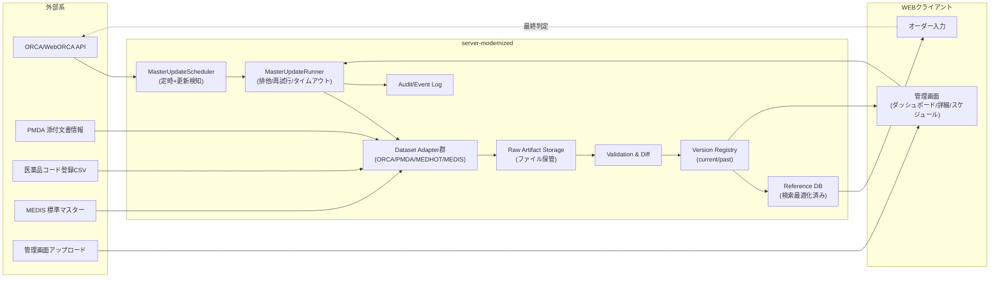

# ORCA/外部マスタ更新基盤 設計（RUN_ID=20260212T003351Z）

- 更新日: 2026-02-12
- 対象: `server-modernized` / `web-client`（管理画面）
- 目的: ORCAマスタを正として、外部マスタを参照DBへ取り込み、診療中は外部アクセスなしでオーダー入力を支援する。

## 1. 設計原則
- ORCAマスタ（点数・診療行為・保険者等）は ORCA を正とする。
- ORCA側のマスタ更新実行は ORCA標準運用に委ね、`server-modernized` から安易に更新実行しない。
- `server-modernized` は「更新検知」「再取り込み」「版管理」「差分管理」「ロールバック」「監査」に責務を限定する。
- 診療中のオンライン外部参照は禁止。外部アクセスは更新ジョブ時のみ。
- 施設ネットワーク制限に備え、管理画面からのファイル手動アップロード更新経路を提供する。
- 失敗時は現行版維持（fail-safe）。壊れた版を current にしない。

## 2. 一次情報からの制約整理

### 2.1 ORCA
- ORCA API一覧に `masterlastupdatev3`（マスタ最終更新日）と `acsimulatev2`（請求シミュレーション）が定義されている。
- `masterlastupdatev3` は `Request_Number=01` のXMLリクエストで更新日を取得する前提。
- `acsimulatev2` は「確定前チェック」に使い、UI推測の断定より ORCA応答を優先する。
- WebORCA DBAPI手順書は `DBSELECT`（SELECTのみ）で、WebORCAクラウド利用は有償注意が明記されている。
- ORCA DBテーブル定義は版番号付きPDFで更新されるため、取り込み実装はテーブル名差異に耐える抽象化が必要。

### 2.2 外部マスタ
- PMDA添付文書は「巡回ダウンロードや過度なアクセス禁止」「複製・頒布禁止」の注意がある。
- PMDAの一括DLは公表導線があるが、利用は院内利用・アクセス制御前提で扱う。
- MEDIS標準マスターは利用条件・許諾が必要な場合があるため、事前同意状態をデータセット設定で管理する。
- 医薬品コード登録システム（MED-XML/CSV）は包装単位等の補完情報源として扱う。

## 3. 全体構成

## 4. モダナイズ版サーバー内のコンポーネント設計

### 4.1 Master Update Service（新設）
- `MasterDatasetCatalogService`
  - データセット定義（名称、提供元URL、更新頻度、形式、利用条件、enabled）管理。
- `MasterUpdateScheduler`
  - 定時起動（cron相当）と ORCA更新検知ポーリング。
- `MasterUpdateRunner`
  - 実行キュー、二重起動防止、timeout、retry、同時実行数制御。
- `MasterDatasetAdapter`（インターフェース）
  - `fetch` / `validate` / `transform` / `load` / `diff` / `rollback` をデータセット単位で実装。
- `MasterVersionService`
  - 版確定、current切替、切戻し、件数・ハッシュ・差分保存。
- `MasterArtifactStorage`
  - 取得原本（zip/csv/xml/json）を保存。監査・再解析に使う。
- `MasterUpdateAuditService`
  - 実行者、実行元（AUTO/MANUAL/UPLOAD）、結果、失敗理由、影響範囲を監査ログ化。

### 4.2 参照DBレイヤ
- 参照検索用の正規化テーブルを `reference_*` 系で保持し、`dataset_version_id` で版を追跡。
- `current_version` のみを検索対象にするビューを提供し、診療中クエリを安定化。
- オーダー候補APIは参照DBのみ参照し、外部サイト直アクセスを禁止。

## 5. データセット定義（初期）

| dataset_code | 名称 | 正本/補完 | 主な取得元 | 形式 | 推奨更新頻度 | 既定更新方式 |
| --- | --- | --- | --- | --- | --- | --- |
| `orca_master_core` | ORCAマスタ取り込み | 正本 | ORCA API + DBSELECT | XML/JSON/DB行 | `masterlastupdatev3` 15分ポーリング + 深夜再同期 | 自動 |
| `drug_package_medhot` | 医薬品包装単位補完 | 補完 | medhot CSV | CSV | 毎日1回 | 自動 + 手動アップロード |
| `pmda_insert_index` | PMDA添付文書インデックス（リンク+改訂） | 補完 | PMDA公開情報 | CSV/ZIP | 毎日1回 | 自動（案1） |
| `medis_standard_master` | MEDIS標準マスター | 補完 | MEDIS提供物 | CSV等 | 週1回（契約条件順守） | 手動優先 + 自動可 |

## 6. データモデル

### 6.1 管理テーブル
- `master_dataset`
  - `dataset_id` (PK), `dataset_code` (UK), `name`, `source_url`, `update_frequency`, `format`, `license_note`, `active`, `created_at`, `updated_at`
- `master_dataset_schedule`
  - `dataset_id` (PK/FK), `auto_enabled`, `cron_expr`, `retry_max`, `timeout_sec`, `concurrency_group`, `poll_interval_sec`, `updated_by`, `updated_at`
- `master_dataset_version`
  - `version_id` (PK), `dataset_id` (FK), `version_tag`, `captured_at`, `record_count`, `content_hash`, `artifact_path`, `diff_summary_json`, `validation_result_json`, `status` (`READY|FAILED|ROLLED_BACK`), `is_current`
- `master_dataset_job`
  - `job_id` (PK), `dataset_id` (FK), `trigger_type` (`AUTO|MANUAL|UPLOAD|ROLLBACK|RETRY`), `requested_by`, `started_at`, `ended_at`, `status`, `error_code`, `error_message`, `run_id`
- `master_dataset_job_log`
  - `job_log_id` (PK), `job_id` (FK), `phase`, `message`, `payload_json`, `logged_at`
- `master_dataset_lock`
  - `dataset_id` (PK), `locked_by_job_id`, `locked_at`, `expires_at`

### 6.2 監査テーブル
- `audit_master_update_event`
  - `event_id` (PK), `dataset_id`, `job_id`, `actor_id`, `action`, `result`, `summary`, `details_json`, `created_at`

### 6.3 参照データ例（抜粋）
- `reference_orca_tensu`（`dataset_version_id`, `tensu_code`, `name`, `valid_from`, `valid_to`, `category`）
- `reference_drug_package`（`dataset_version_id`, `hot_code`, `yj_code`, `package_unit`, `package_quantity`）
- `reference_pmda_insert_index`（`dataset_version_id`, `med_code`, `document_url`, `revised_at`, `safety_notice`）

## 7. キー設計

### 7.1 ORCAマスタ
- 主キー: ORCA公開コード（例: 点数コード、用法コード、保険者番号）
- 複合キー: `code + valid_from`（同一コード改定対応）
- 版追跡: 全行に `dataset_version_id` を付与

### 7.2 MEDHOT 包装単位
- 主キー候補: `hot_code`
- ORCA薬剤結合: `yj_code` か `receipt_code` を補助キーとして保持

### 7.3 PMDA（案1: リンク+改訂）
- 主キー候補: `med_code + document_type`
- 本文は保持しない。`document_url` と `revised_at` のみ保持

### 7.4 MEDIS
- 契約に従う識別子を採用（例: 標準病名コード）
- 許諾状態 (`license_approved_at`, `license_scope`) をデータセット定義に保持

## 8. 更新フロー

### 8.1 自動更新
1. Scheduler がデータセットごとに起動条件を判定。
2. `orca_master_core` は `masterlastupdatev3` で更新日を比較。
3. 更新あり、または定時再同期に該当したら `MasterUpdateRunner` がジョブ開始。
4. アダプタが取得→検証→差分算出→参照DBへロード。
5. 検証成功時のみ `is_current=true` に切替。
6. 監査ログへ結果保存。失敗時は現行版維持。

### 8.2 手動更新（管理画面）
1. 管理者が対象データセットで `手動更新` 実行。
2. 二重起動チェック（lock）に通過したジョブのみ開始。
3. 実行者・時刻を監査記録。
4. 成功時は差分と検証結果を表示、失敗時は再試行ボタンを提示。

### 8.3 手動アップロード更新
1. 管理者がファイルをアップロード。
2. ハッシュ重複・形式・件数妥当性を検証。
3. 問題なければ新バージョン確定、問題あればreject（現行維持）。

### 8.4 失敗時
- `status=FAILED` を `master_dataset_job` に記録。
- `master_dataset_version` は `READY` の current を維持（切替しない）。
- 失敗理由（接続不達/形式不正/件数異常/ライセンス違反）を分類して保持。
- 再試行はジョブ単位で可能。

### 8.5 ロールバック
1. 管理画面でロールバック対象版を選択。
2. 影響範囲（件数差、更新日時、対象画面）を確認表示。
3. 承認後、`is_current` を旧版へ切替。
4. `ROLLBACK` 監査イベントを記録し、関連キャッシュを破棄。

## 9. ORCA更新の二段設計（誤解防止）

### A. ORCA側マスタ更新そのもの
- ORCA標準運用（自動更新設定）を前提とする。
- ORCAを外部から更新実行するAPIが明確に公開されるまで、`server-modernized` から更新実行しない。
- 管理画面では ORCA最終更新日と差分検知状態のみ可視化する。

### B. `server-modernized` への反映
- `masterlastupdatev3` の更新検知で再取り込みを自動起動。
- 管理画面からいつでも手動再取り込み可能。
- 差分（増減件数、改定対象）を版ごとに記録。

## 10. 外部マスタ方針

### 10.1 PMDA（優先: 案1）
- 案1（採用）: 本文非保持。リンク/改訂情報のみ保持。
  - メリット: 規約順守しやすく軽量。
  - 必須: 出典URL・改訂日・取得日時・利用目的を記録。
- 案2（将来）: 院内閉域で本文保持。
  - 必須: RBAC、監査ログ、ダウンロード制限、配布禁止明示。

### 10.2 MEDHOT
- CSV取得を基本とし、外部不達時は手動アップロードで代替。
- 既知コードの単位変更を差分ハイライトし、誤入力防止に反映。

### 10.3 MEDIS
- 利用許諾状態を満たすまで `active=false` のまま運用。
- 許諾条件違反を検知した場合は自動更新停止。

## 11. 管理画面API案（server-modernized）

- `GET /api/admin/master-updates/datasets`
  - 一覧: 最終更新、状態、現行版件数、更新検知状態、最新失敗要約
- `GET /api/admin/master-updates/datasets/{datasetCode}`
  - 詳細: 定義、版履歴（直近5件）、差分、検証結果
- `POST /api/admin/master-updates/datasets/{datasetCode}/run`
  - 手動更新起動
- `POST /api/admin/master-updates/datasets/{datasetCode}/upload`
  - 手動ファイルアップロード更新
- `POST /api/admin/master-updates/datasets/{datasetCode}/rollback`
  - 指定版へ切戻し
- `GET /api/admin/master-updates/schedule`
  - スケジュール一覧取得
- `PUT /api/admin/master-updates/schedule`
  - 自動更新時刻、再試行、timeout、同時実行数、ORCAポーリング間隔を更新

## 12. オーダー入力での利用方針
- 候補提示、単位補完、注意喚起は参照DB（current版）を利用。
- 最終確定前チェックは ORCAの `acsimulatev2`（または同等API）を優先。
- UI文言は「原因」と「修正手順」を同時に提示する。
  - 例: `算定不可: 点数コード 114001210 は 2026-04-01 改定で失効。候補 114001310 に置換してください。`

## 13. 非機能要件
- 可用性: 外部不達でも診療機能を継続（現行版固定）。
- 性能: 更新ジョブと診療トラフィックを分離（別スレッド/キュー）。
- 監査: すべての手動操作に actor/timestamp/action/result を記録。
- セキュリティ: 外部取り込みファイルはハッシュ検証し、原本を改ざん不可領域へ保管。

## 14. テスト観点

| 区分 | テスト内容 | 期待結果 |
| --- | --- | --- |
| 更新失敗 | 外部サイト5xx/timeout | ジョブ失敗、現行版維持、再試行可能 |
| ORCA更新検知 | `masterlastupdatev3` 変更あり | 自動再取り込みが起動、差分保存 |
| ORCA更新なし | 変更なし | ジョブ未起動（または軽量スキップ） |
| 形式不正 | CSV列不足/文字コード異常 | 検証失敗、reject、監査記録 |
| 手動アップロード | 正常ファイル投入 | 新版作成、current切替 |
| ロールバック | 旧版指定 | currentが旧版へ切替、監査記録 |
| 二重起動防止 | 同時に手動更新連打 | 先行のみ実行、後続は409相当 |
| 算定チェック連携 | ORCAシミュレーション警告 | UIに原因+修正案が表示 |

## 15. 実装順序（推奨）
1. スキーマ（`master_dataset*` + 監査）追加
2. `orca_master_core` の更新検知+版管理
3. 管理画面3画面（一覧/詳細/スケジュール）
4. `drug_package_medhot` 手動アップロード対応
5. PMDA案1（リンク+改訂情報）
6. MEDIS（許諾フラグ前提）
7. ORCA算定チェック連携のエラーメッセージ改善

## 16. 参照一次情報
- ORCA API仕様一覧: https://www.orca.med.or.jp/receipt/tec/api/overview.html
- ORCA マスタ最終更新日取得: https://www.orca.med.or.jp/receipt/tec/api/master_last_update.html
- ORCA 請求金額シミュレーション: https://www.orca.med.or.jp/receipt/tec/api/acsimulate.html
- WebORCA DBAPI手順書: https://ftp.orca.med.or.jp/pub/data/weborca-onpre/weborcaonpre-dbapi-manual-20230418.pdf
- ORCA DBテーブル定義: https://www.orca.med.or.jp/receipt/tec/database_table_definition_edition.html
- ORCAマニュアル: https://orcamanual.orca.med.or.jp/gairai
- PMDA 添付文書注意書き: https://www.info.pmda.go.jp/psearch/html/menu_tenpu_comment.html
- PMDA 添付文書一括DL案内: https://www.pmda.go.jp/safety/info-services/medi-navi/0012.html
- 医薬品コード登録システム: https://medhot.medd.jp/view_download
- MEDIS 利用条件: https://www.medis.or.jp/4_hyojyun/medis-master/riyou/index.html
