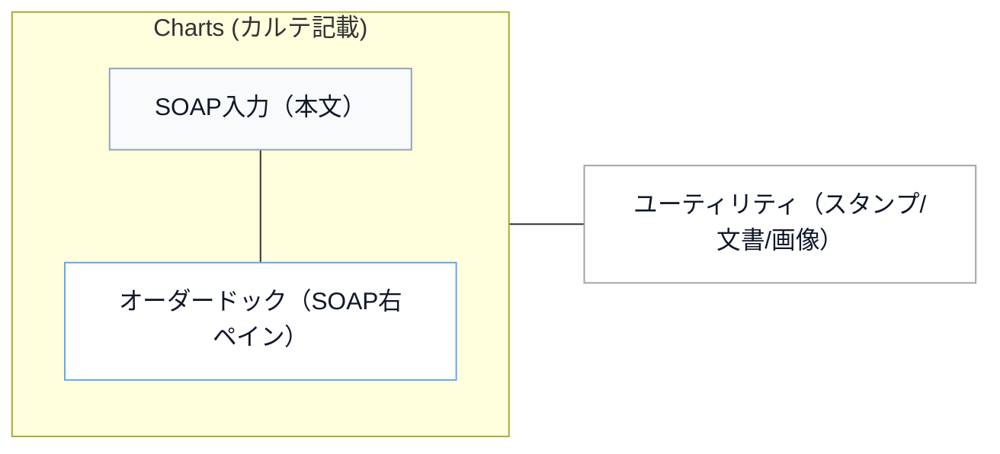
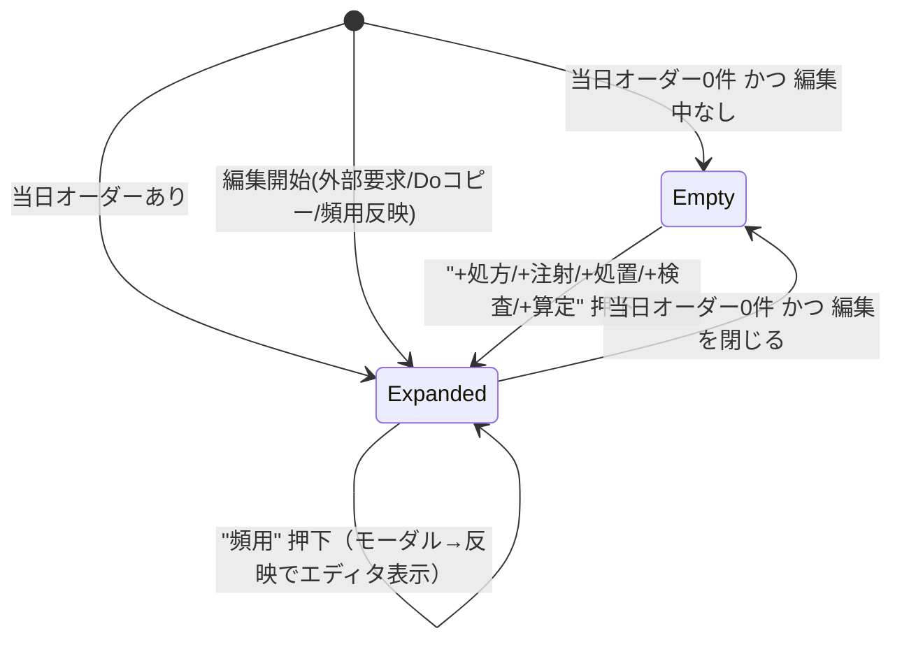
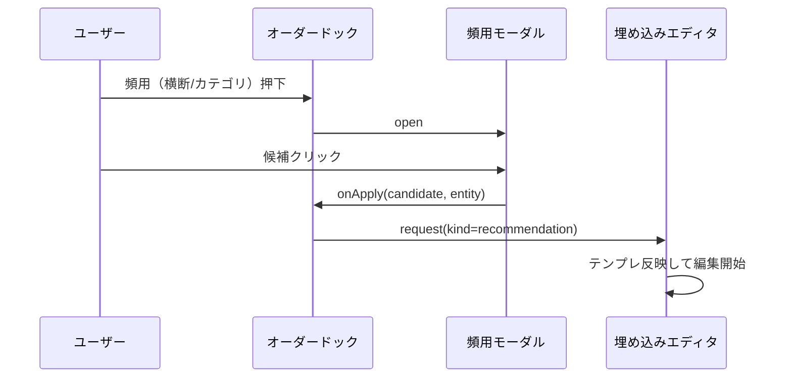

# Charts オーダーUI: SOAP右ペイン統合「オーダードック」仕様（RUN_20260214T233741Z）

- 作成日: 2026-02-15
- 対象: Webクライアント Charts（カルテ記載 / SOAP）画面のオーダー入力
- 目的:
  - 旧来クライアントの「カテゴリ単位で追加→編集」導線を、モダナイズ版（Web）に統合する
  - SOAP入力の右側に常設し、画面遷移/タブ切替なしで“当日オーダー”を把握・編集できる
  - 頻用オーダーは常設せず、ボタン押下でモーダルを開いて反映する

## 1. 画面レイアウト（シェーマ）

### 右ペインの役割
- `SOAP右ペイン` = **当日オーダーの追加/編集の常設スペース**
- `ユーティリティ` = **スタンプ/文書/画像**（オーダー入力はここから撤去）

## 2. 表示状態（状態遷移）

## 3. カテゴリ構成（Web上のまとめ方）

### 3.1 大カテゴリ（右ペインで常に見える単位）
- 処方: `medOrder`
- 注射: `injectionOrder`
- 処置: `treatmentOrder` / `generalOrder` / `surgeryOrder` / `otherOrder`
- 検査: `testOrder` / `physiologyOrder` / `bacteriaOrder` / `radiologyOrder`
- 算定: `baseChargeOrder` / `instractionChargeOrder`

### 3.2 サブ種別の選択
- 処置/検査/算定は、カテゴリ内に **「種類」セレクト**を持ち、追加（`＋`）時のデフォルトentityを決定する

## 4. 入力UIのルール

### 4.1 「何もない」状態（ミニボタン）
- 当日オーダー0件かつ編集中なしの場合:
  - 右ペインは **ミニボタンのみ**（`+処方`, `+注射`, `+処置`, `+検査`, `+算定`）
  - クリックで該当カテゴリの空欄エディタを展開

### 4.2 「ある」状態（展開 + 編集）
- 既存オーダー束をカテゴリ別に一覧表示
- 各束は:
  - `編集`（フォーム展開）
  - `削除`（確認ダイアログの後、削除）
- 各カテゴリの下部に `＋` を配置し、押下で空欄入力欄（埋め込みエディタ）を表示

## 5. 頻用オーダー（モーダル）

### 5.1 表示スコープ
- `このカテゴリ`（カテゴリ内の候補のみ）
- `横断`（カテゴリ横断の候補を、候補ごとの `entity` でグルーピング表示）

### 5.2 反映先
- 右ペイン内の埋め込みエディタにテンプレを反映して編集開始する

## 6. 実装上の主要コンポーネント

- `web-client/src/features/charts/OrderDockPanel.tsx`
  - SOAP右ペインの常設UI（ミニボタン/カテゴリ展開/編集/削除/頻用）
- `web-client/src/features/charts/OrderRecommendationModal.tsx`
  - 頻用オーダーのモーダル（カテゴリ/横断 切替 + 検索 + 反映）
- `web-client/src/features/charts/OrderBundleEditPanel.tsx`
  - `variant="embedded"` を追加し、ドックに埋め込めるように拡張

